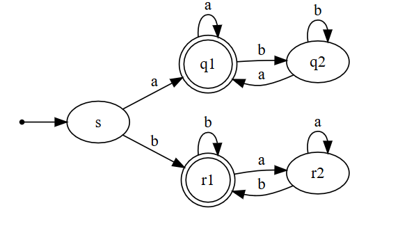

# Finite Automaton Simulator

[](https://badge.fury.io/js/fas-js)
[](https://david-dm.org/jml6m/fas-js?type=dev)
[](https://snyk.io/test/github/jml6m/fas-js)
[](https://codecov.io/gh/jml6m/fas-js)
[](https://www.jsdelivr.com/package/npm/fas-js)

Easily create and simulate state machines using this JS library. Import into your own server side or browser based JS application.


###### Visualization of an FSA

## Installation:
Add the latest version of `fas-js` to your package.json:
```
npm install fas-js --save-dev
```

Import the ES6 module:
```
var fas_js = require('fas-js');
```

Import into HTML file
```
<script src="https://cdn.jsdelivr.net/npm/fas-js/lib/bundle.js"></script>
```

## Background
A finite automaton is a formally defined state machine, a concept that can then be expanded on to build more complex and powerful computational machines. I highly recommend the book "Introduction to the Theory of Computation" by Michael Sipser if you want to learn more about state machines and related concepts.

A **Finite State Automaton (FSA)** is defined as a 5-tuple (Q, Σ, δ, q0, F) where:

1. Q is a finite set called **states**
2. Σ is a finite set called **alphabet**
3. δ: Q x Σ → Q is the **transition function**
4. q0 ∈ Q is the **start state**
5. F ⊆ Q is the set of **accept states**

An FSA (a type of state machine) recognizes exactly one language. More formally, if A is the set of all strings that a given machine M accepts, then we can say that A is the language of machine M, or L(M) = A. When we say that M recognizes A, it means that the machine M accepts all possible strings within A. This library gives you tools to simulate a given input string <i>w</i> to determine if <i>w</i> ∈ A.

An FSA can be conceptualized as a [Directed Graph](https://en.wikipedia.org/wiki/Directed_graph), and more specifically, an [Oriented Graph](https://en.wikipedia.org/wiki/Orientation_(graph_theory)). It's often visualized in this way for teaching and demonstration (see below) purposes. It is also important to understand [Sets](https://en.wikipedia.org/wiki/Set_(mathematics)) and their logical operators when working with FSAs.

## Usage
First, define your FSA according to the definition above.

```javascript
/*
* Q cannot be empty, and each state name must be unique
* Type: string[]
*/
const states = ["q1", "q2"];

/*
* Σ cannot be empty, and can be passed in as one string (each character will be interpreted as a separate symbol) or a string array
* Cannot contain duplicate symbols
* Type: string | string[]
*/
const alphabet = "01";

/*
* δ is an array of Objects that define the transitions for each alphabet symbol, for each state
* size of Q x size of Σ = size of transition set
* Each transition must contain: an origin state, a destination state, and an input symbol
* Type: Array<Object>
*/
const tfunc = [ // from=origin_state, to=dest_state, input=symbol
    { from: "q1", to: "q2", input: "1" },
    { from: "q2", to: "q1", input: "0" },
    { from: "q2", to: "q2", input: "1" },
    { from: "q1", to: "q1", input: "0" }
];

/*
* q0 is the start state of the FSA. The first symbol of the input string is processed on this state.
* q0 must be a member of Q
* Type: string
*/
const start = "q1";

/*
* F is the set of accept states, which determine whether a provided input is "accepted" by the FSA or "rejected".
* This determination is made after the last symbol has been read by checking if the final state is in the accepting set
* F must be a subset of Q - it can also be an empty set (signifies an FSA that always rejects)
* For simulation purposes, F is passed in as a string array that cannot contain duplicate states
* Type: string[]
*/
const accepts = ["q1"]; // Note here that the start state can also be an accept state

// createFSA() takes the 5 objects defined above, according to the definition, and returns a custom FSA object as seen in FSA.js
const fsa = createFSA(states, alphabet, tfunc, start, accepts);
```
There are two simulation options available:<br />

<b>simulateFSA</b>(<i>w</i>: string[], <i>fsa</i>: FSA, <i>logging</i>: boolean = false): string [<>](https://github.com/jml6m/fas-js/blob/master/src/globals/globals.js "Source")

Runs the entire input <i>w</i> through the finite state automaton <i>fsa</i>. <i>w</i> is passed in as an array of strings and must only contain symbols from the alphabet defined in <i>fsa</i>. This function returns a string representing the final state, which can be compared with your <i>accepts</i> array to determine if input <i>w</i> is accepted by this FSA.

<b>stepOnceFSA</b>(w: string, qin: string, fsa: FSA, logging: boolean = false): string [<>](https://github.com/jml6m/fas-js/blob/master/src/globals/globals.js "Source")

Returns the destination state, based on input symbol <i>w</i> and input state <i>qin</i>, as defined by δ of <i>fsa</i>. <i>w</i> is passed in as a string and must match a symbol from the alphabet defined in <i>fsa</i>. <i>qin</i> must be a state in Q. Use this function if you'd like to iterate through a full input string step-by-step.

Note: In both functions above, a third <i>logging</i> parameter is available (defaults to false) which will print useful messages to the console as the simulator processes the input string. This can be used for debugging purposes or server-side logs. It is recommended to leave it defaulted to false for browser applications.

```javascript
/*
* Both simulators require an FSA input created with createFSA(). Here we will use the FSA created in the above block.
* fsa is a machine which accepts strings that end with 0
*/
simulateFSA("0", fsa); // returns "q1"
simulateFSA("01", fsa); // returns "q2"
simulateFSA("010", fsa); // returns "q1"
simulateFSA("", fsa); // returns "q1"

stepOnceFSA("0", "q1", fsa); // returns "q1"
stepOnceFSA("1", "q1", fsa); // returns "q2"
stepOnceFSA("0", "q2", fsa); // returns "q1"
stepOnceFSA("1", "q2", fsa); // returns "q2"

// Check for acceptance
const finalState = simulateFSA("010", fsa);
if(accepts.indexOf(finalState) !== -1)
    console.log("Accepted!");
else
    console.log("Rejected!");

// Step through an input string w
const w = "01101";
let inputState = start; // The first input state is q0
for (const symbol of w) {
    inputState = stepOnceFSA(symbol, inputState, fsa);
}
// Now, check for acceptance...

```

## Demo
This library provides an engine that creates and simulates an FSA. However, it does not include any visualization components. The demo below provides a UI that utilizes this engine and visualizes the FSA as it's being processed. It's a great way to learn about FSAs and experiment with your own FSA creations! The UI and graph visualizations were built using [preact](https://github.com/developit/preact), [d3.js](https://github.com/d3/d3), and [d3-graphviz](https://github.com/magjac/d3-graphviz).

[Demo on ObservableHQ](https://beta.observablehq.com/@jml6m/state-machine-simulator) (Learn more about ObservableHQ [here](https://beta.observablehq.com/collection/@observablehq/introduction))

## License
This library is distributed under the GPL 3.0 license found in the [LICENSE](https://github.com/jml6m/fas-js/blob/master/LICENSE) file.
